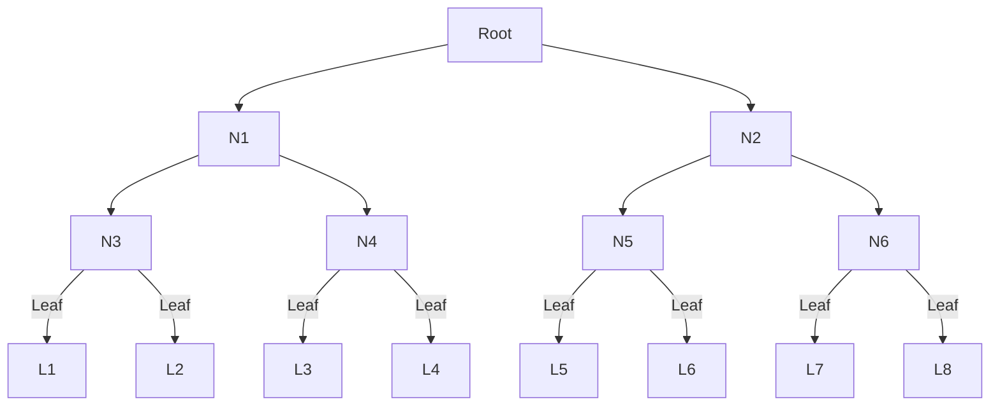

# Zerokit Utils Crate

[](https://crates.io/crates/zerokit_utils)
[](https://opensource.org/licenses/MIT)
[](https://opensource.org/licenses/Apache-2.0)

**Zerokit Utils** provides essential cryptographic primitives optimized for zero-knowledge applications.
This crate features efficient Merkle tree implementations and a Poseidon hash function,
designed to be robust and performant.

## Overview

This crate provides core cryptographic components optimized for zero-knowledge proof systems:

- **Multiple Merkle Trees**: Various implementations optimised for the trade-off between space and time.
- **Poseidon Hash Function**: An efficient hashing algorithm suitable for ZK contexts, with customizable parameters.
- **Parallel Performance**: Leverages Rayon for significant speed-ups in Merkle tree computations.
- **Arkworks Compatibility**: Poseidon hash implementation is designed to work seamlessly
  with Arkworks field traits and data structures.

## Merkle Tree Implementations

Merkle trees are fundamental data structures for verifying data integrity and set membership.
Zerokit Utils offers two interchangeable implementations:

### Understanding Merkle Tree Terminology

To better understand the structure and parameters of our Merkle trees, here's a quick glossary:

- **Depth (`depth`)**: level of leaves if we count from root.
  If the root is at level 0, leaves are at level `depth`.
- **Number of Levels**: `depth + 1`.
- **Capacity (Number of Leaves)**: $2^{\text{depth}}$. This is the maximum number of leaves the tree can hold.
- **Total Number of Nodes**: $2^{(\text{depth} + 1)} - 1$ for a full binary tree.

**Example for a tree with `depth: 3`**:

- Number of Levels: 4 (levels 0, 1, 2, 3)
- Capacity (Number of Leaves): $2^3 = 8$
- Total Number of Nodes: $2^{(3+1)} - 1 = 15$

Visual representation of a Merkle tree with `depth: 3`:



### Available Implementations

- **FullMerkleTree**
  - Stores all tree nodes in memory.
  - Use Case: Use when memory is abundant and operation speed is critical.

- **OptimalMerkleTree**
  - Stores only the nodes required to prove the accumulation of set leaves (i.e., authentication paths).
  - Use Case: Suited for environments where memory efficiency is a higher priority than raw speed.

#### Parallel Processing with Rayon

Both `OptimalMerkleTree` and `FullMerkleTree` internally utilize the Rayon crate
to accelerate computations through data parallelism.
This can lead to significant performance improvements, particularly during updates to large Merkle trees.

## Poseidon Hash Implementation

This crate provides an implementation for computing Poseidon hash round constants and MDS matrices.
Key characteristics include:

- **Customizable parameters**: Supports various security levels and input sizes,
  allowing you to tailor the hash function to your specific needs.
- **Arkworks-friendly**: Adapted to integrate smoothly with Arkworks field traits and custom data structures.

### ⚠️ Security Note

The MDS matrices used in the Poseidon hash function are generated iteratively
using the Grain LFSR (Linear Feedback Shift Register) algorithm until specific cryptographic criteria are met.

- The reference Poseidon implementation includes validation algorithms to ensure these criteria are satisfied.
  These validation algorithms are not currently implemented in this crate.
- For the hardcoded parameters provided within this crate,
  the initially generated random matrix has been verified to meet these conditions.
- If you intend to use custom parameters, it is crucial to verify your generated MDS matrix.
  You should consult the Poseidon reference implementation to determine
  how many matrices are typically skipped before a valid one is found.
  This count should then be passed as the `skip_matrices parameter` to the `find_poseidon_ark_and_mds`
  function in this crate.

## Installation

Add zerokit-utils as a dependency to your Cargo.toml file:

```toml
[dependencies]
zerokit-utils = "1.0.0"
```

## Building and Testing

```bash
# Build the crate
cargo make build

# Run tests
cargo make test

# Run benchmarks
cargo make bench
```

To view the results of the benchmark, open the `target/criterion/report/index.html` file generated after the bench

## Acknowledgements

- The Merkle tree implementations are adapted from:
  - [kilic/rln](https://github.com/kilic/rln/blob/master/src/merkle.rs)
  - [worldcoin/semaphore-rs](https://github.com/worldcoin/semaphore-rs/blob/d462a4372f1fd9c27610f2acfe4841fab1d396aa/src/merkle_tree.rs)

- The Poseidon implementation references:
  - [Poseidon reference implementation](https://extgit.iaik.tugraz.at/krypto/hadeshash/-/blob/master/code/generate_parameters_grain.sage)
